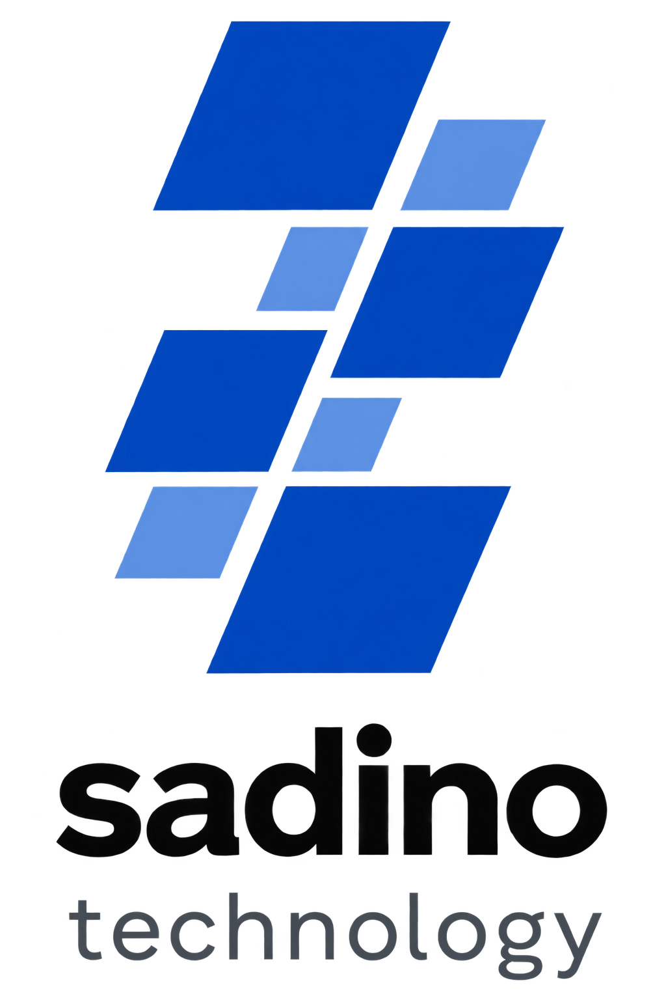

<div align="center">



# Sadino Technology

**Engineering premium digital experiences for the modern world.**

Website resmi Sadino Technology — software house yang berfokus pada pengembangan produk digital berkualitas tinggi untuk bisnis skala startup hingga enterprise.

[](http://www.sadinotech.com)
[](https://instagram.com/sadino.tech)
[](mailto:admin@sadinotech.com)

</div>

---

## 🏢 Tentang Sadino Technology

Sadino Technology adalah software house yang didirikan pada 2025 dengan misi membangun jembatan antara ide bisnis visioner dan eksekusi teknis yang solid. Kami adalah tim multidisiplin — arsitek, developer, dan desainer — yang bekerja dengan pendekatan **"The Digital Architect"**: membangun sistem digital yang skalabel, estetis, dan berdampak nyata.

### Layanan Utama

| Layanan                | Deskripsi                                                 |
| ---------------------- | --------------------------------------------------------- |
| 🌐 **Web Development** | Aplikasi web modern, responsif, dan berperforma tinggi    |
| 🎨 **UI/UX Design**    | Desain antarmuka yang intuitif dan berpusat pada pengguna |
| ⚙️ **API / Backend**   | Solusi server-side yang skalabel dan aman                 |
| 🏢 **Company Profile** | Website profesional untuk identitas bisnis                |
| 📱 **Mobile Apps**     | Aplikasi iOS & Android native maupun cross-platform       |

### Statistik

- **10+** Proyek Terselesaikan
- **5+** Tahun Pengalaman
- **5+** Klien Global

---

## 🛠️ Tech Stack

Project ini dibangun dengan teknologi berikut:

**Framework & Library**

- [Next.js 16](https://nextjs.org/) — App Router, Server Components
- [React 19](https://react.dev/) — UI library
- [TypeScript 5](https://www.typescriptlang.org/) — Static typing
- [Tailwind CSS 4](https://tailwindcss.com/) — Utility-first styling

**Animasi & UI**

- [Framer Motion 12](https://www.framer.com/motion/) — Animasi dan transisi
- [Lucide React](https://lucide.dev/) — Icon set (1.5px stroke weight)
- [@iconify/react](https://iconify.design/) — Extended icon library

**Linting & Tools**

- ESLint + eslint-config-next
- PostCSS + @tailwindcss/postcss

---

## 📁 Struktur Project

```
sadino-technology/
├── app/                    # Next.js App Router
│   ├── about/              # Halaman About
│   ├── articles/           # Halaman Blog & Detail Artikel
│   ├── contact/            # Halaman Kontak
│   ├── portfolio/          # Halaman Portfolio & Detail Project
│   ├── pricing/            # Halaman Harga
│   ├── services/           # Halaman Layanan & Detail Layanan
│   ├── globals.css         # Global styles & design tokens
│   ├── layout.tsx          # Root layout (Navbar + Footer)
│   └── page.tsx            # Halaman Home
│
├── components/
│   ├── articles/           # Komponen halaman Blog
│   ├── layouts/            # Navbar & Footer
│   ├── portfolio/          # Komponen halaman Portfolio
│   ├── sections/           # Section reusable (Hero, CTA, dll)
│   └── services/           # Komponen halaman Layanan
│
├── constants/
│   ├── articles.ts         # Data artikel blog
│   ├── data.js             # Data kontak, layanan, portofolio
│   ├── portfolios.ts       # Data detail portfolio
│   └── services.ts         # Data detail layanan
│
├── lib/
│   └── animations.ts       # Framer Motion variants
│
├── public/
│   └── images/             # Logo & aset gambar statis
│
├── next.config.ts          # Konfigurasi Next.js
└── package.json
```

---

## 🚀 Cara Menjalankan Project

### Prasyarat

Pastikan sudah terinstall di komputer:

- **Node.js** versi `18` atau lebih baru → [Download Node.js](https://nodejs.org/)
- **npm** (sudah termasuk bersama Node.js)

Cek versi dengan perintah:

```bash
node -v    # minimal v18.0.0
npm -v     # minimal v9.0.0
```

---

### 1. Clone / Extract Project

Jika dari file ZIP/RAR, extract ke folder pilihan kamu. Jika dari Git:

```bash
git clone <repository-url>
cd sadino-technology
```

---

### 2. Install Dependencies

```bash
npm install
```

> Proses ini akan mengunduh semua package yang dibutuhkan ke folder `node_modules/`. Tunggu hingga selesai (1–3 menit tergantung koneksi internet).

---

### 3. Jalankan Development Server

```bash
npm run dev
```

Buka browser dan akses:

```
http://localhost:2050
```

> Port default project ini adalah **2050** (sudah dikonfigurasi di `package.json`).

---

### 4. Build untuk Production

Jika ingin deploy ke server atau hosting:

```bash
# Build project
npm run build

# Jalankan versi production
npm run start
```

Production server berjalan di:

```
http://localhost:3000
```

---

### Perintah Tersedia

| Perintah        | Fungsi                                      |
| --------------- | ------------------------------------------- |
| `npm run dev`   | Menjalankan development server di port 2050 |
| `npm run build` | Build project untuk production              |
| `npm run start` | Menjalankan production server               |
| `npm run lint`  | Menjalankan ESLint untuk cek kode           |

---

## ⚙️ Konfigurasi

### Mengganti Data Bisnis

Semua data konten dapat diubah di folder `constants/`:

- **`constants/data.js`** — Kontak, layanan, dan daftar portofolio singkat
- **`constants/portfolios.ts`** — Detail setiap project portfolio
- **`constants/services.ts`** — Detail setiap halaman layanan
- **`constants/articles.ts`** — Konten artikel blog

### Mengganti Logo

Ganti file di:

```
public/images/logo.png
```

Ukuran yang direkomendasikan: **64×64px** atau **128×128px** (format PNG transparan).

### Mengganti Warna / Design Tokens

Edit variabel di `app/globals.css`:

```css
:root {
  --color-primary: #004ac6;
  --color-primary-container: #2563eb;
  --color-surface: #f7f9fb;
  --color-surface-container: #f2f4f6;
}
```

---

## 📬 Kontak

| Channel      | Info                                                |
| ------------ | --------------------------------------------------- |
| 📞 WhatsApp  | [082310001570](https://wa.me/62082310001570)        |
| 📧 Email     | [admin@sadinotech.com](mailto:admin@sadinotech.com) |
| 🌐 Website   | [www.sadinotech.com](http://www.sadinotech.com)     |
| 📸 Instagram | [@sadino.tech](https://instagram.com/sadino.tech)   |
| 📍 Lokasi    | Indonesia                                           |

---

<div align="center">

© 2025 Sadino Technology. Built for the Digital Architect.

</div>
